## Evolution of Evangelion Clock 
Neon Genesis Evangelion (EVA) is an anime series that span over 26 years of production.

I think the GUI (Graphical User Interface) designs in EVA might be inspiring for graphic designers. And it is quite interesting to see how the design preferences changed over time.

In this repository, I listed out all the **Evangelion Clock** appearance in the series. For those who like the anime and graphic design, enjoy!

> Note the higher resolution gif files are under `images\large\`

> **WARNING**: This repo is large (>260MB).

## Evangelion Clocks Design

| Episode ID | Timestamp | From Status | To Status | Design | Remarks | Preview |
|---|---|---|---|---|---|---|
| NGE01 | 00:00:51 | EXTERNAL | INTERNAL | V1 | Yellow Fonts |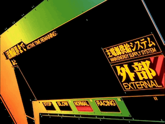
| NGE03 | 00:16:44 | EXTERNAL | INTERNAL | V1 | - |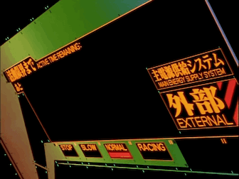
| NGE03 | 00:19:09 | INTERNAL | DANGER | V1 | - |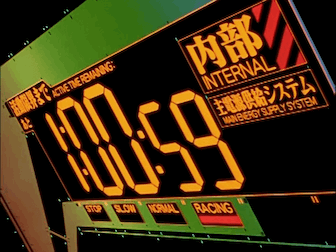
| NGE08 | 00:14:27 | INTERNAL | EXTERNAL | V1 | Amber Fonts |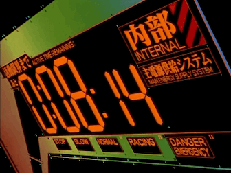
| NGE09 | 00:19:48 | EXTERNAL | INTERNAL | V1 | Glowing Fonts |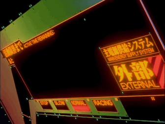
| NGE19 | 00:18:15 | - | STOP | V1 | - |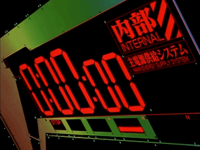
| DEA | 00:13:25 | EXTERNAL | INTERNAL | V1 | Color Saturation |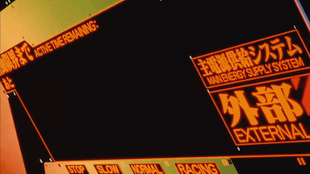
| REB | 00:23:23 | EXTERNAL | INTERNAL | V1 | - |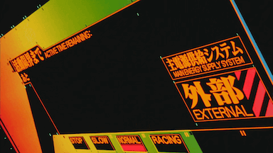
| EOE | 00:38:14 | DANGER | STOP| V1 | -     | 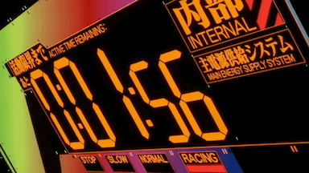
| EVA1 | 00:35:00 | EXTERNAL | INTERNAL | V2 | - |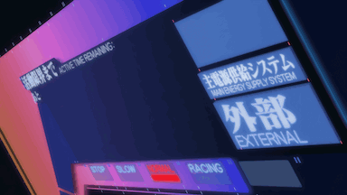
| EVA1 | 00:42:58 | EXTERNAL | INTERNAL | V2 | -|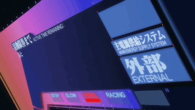
| EVA1 | 00:44:57 | INTERNAL | DANGER | V2 | -|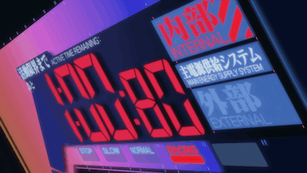
| EVA2 | 00:33:15 | EXTERNAL | INTERNAL | V2 | -|
| EVA2 | 00:35:59 | - | DANGER | V2 | Purple |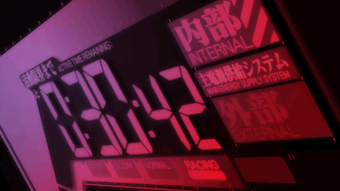
| EVA2 | 00:37:12 | - | AUXILIARY | V2 | Blue |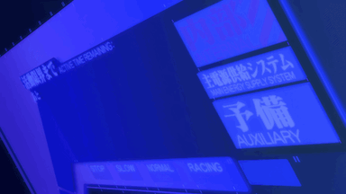
| EVA2 | 01:30:28 | - | BEAST | V2 | Glitch |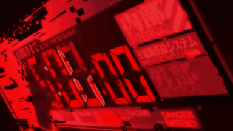
| EVA2 | 01:30:49 | - | BEAST | V2 | Glitch |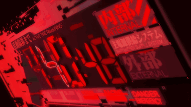
| EVA2 | 01:38:15 | - | STOP | V2 | - |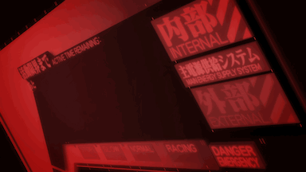
| EVA3+1 | 02:12:31 | EXTERNAL | INTERNAL | V0 | German|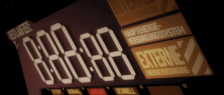

## Episode ID

| Year | Title | Episode ID |
|---|---|---|
| 1995 | 新世紀エヴァンゲリオン  Neon Genesis Evangelion | NGE01 to NGE26 |
| 1997 | 新世紀エヴァンゲリオン劇場版 シト新生  EVANGELION: DEATH & REBIRTH | DEA REB |
| 1997 | 新世紀エヴァンゲリオン劇場版 Air/まごころを、君に  THE END OF EVANGELION | EOE |
| 1998 | 新世紀エヴァンゲリオン劇場版 DEATH(TRUE)2/Air/まごころを、君に  REVIVAL OF EVANGELION | ROE |
| 2007 | ヱヴァンゲリヲン新劇場版:序  EVANGELION:1.0 YOU ARE (NOT) ALONE. | EVA1 |
| 2009 | ヱヴァンゲリヲン新劇場版:破  EVANGELION:2.0 YOU CAN (NOT) ADVANCE. | EVA2 |
| 2012 | ヱヴァンゲリヲン新劇場版:Q  EVANGELION:3.0 YOU CAN (NOT) REDO. | EVA3 |
| 2021 | シン・エヴァンゲリオン劇場版𝄇  EVANGELION:3.0+1.0 | EVA3+1 |
